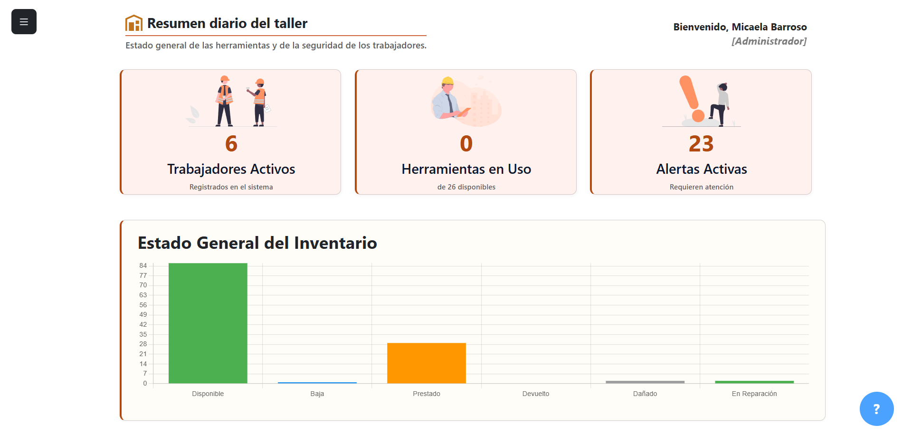
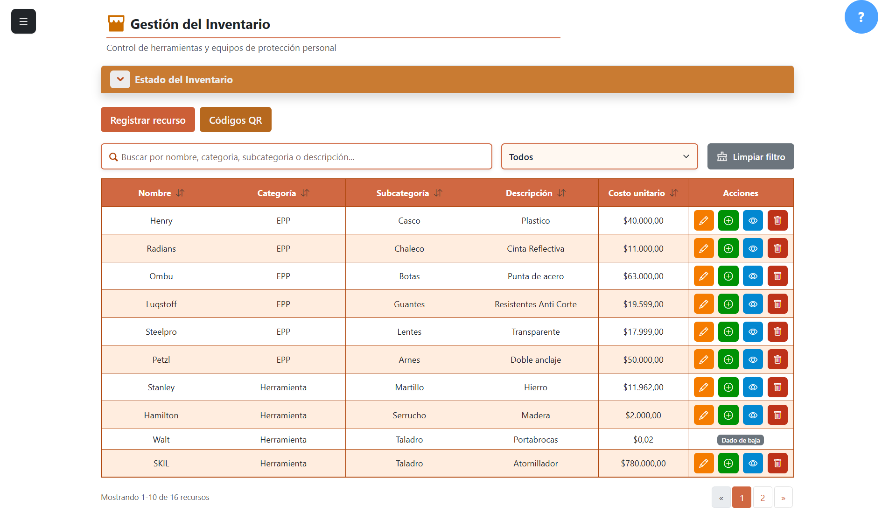
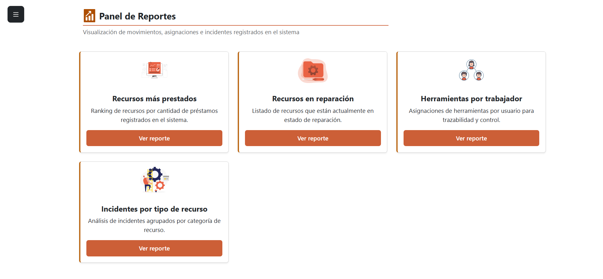

# SafeStock – Sistema de gestión de inventario y seguridad en talleres

SafeStock es un sistema desarrollado en **Laravel** que busca mejorar la seguridad y organización en talleres, garantizando el cumplimiento del **equipamiento de protección personal (EPP)** y el control de herramientas.


---

## Objetivo

SafeStock nace como respuesta a los frecuentes accidentes laborales ocasionados por el incumplimiento del uso de EPP y la falta de una administración efectiva de herramientas.  

El sistema brinda una solución integral para supervisores y trabajadores, permitiendo:

- Controlar el estado de las herramientas.
- Registrar préstamos y devoluciones.
- Validar el cumplimiento de checklist de seguridad.
- Detectar faltantes y vencimientos de EPP.
- Administrar usuarios, roles e incidentes.

---

## Funcionalidades

### Dashboard
- Resumen diario del taller.
- Estado general de herramientas y seguridad de los trabajadores.
- Checklist del día con validación de EPP por trabajador.

### Inventario
- Gestión completa de recursos y equipos.
- Búsqueda por nombre, categoría, subcategoría o descripción.
- Filtros por estado (disponible, baja, reparación, préstamo).
- Administración de series de recursos.

### Control de EPP
- Registro de cumplimiento de checklist diario.
- Asignación de EPP a trabajadores.
- Detección de faltantes y pendientes.
- Alertas de vencimientos próximos.

### Reportes
- Movimientos y préstamos registrados.
- Ranking de recursos más prestados.
- Listado de recursos en reparación.
- Herramientas por trabajador para trazabilidad.
- Incidentes agrupados por tipo de recurso.

### Usuarios
- Administración de usuarios, roles y permisos.
- Alta de nuevos usuarios.
- Filtros por estado y rol.
- Registro de último acceso.

### Incidentes
- Registro y análisis de incidentes.
- Búsqueda por trabajador, motivo, estado o resolución.
- Seguimiento de resolución de problemas.

### Préstamos
- Registro de préstamos de recursos.
- Búsqueda por recurso, serie, trabajador o creador.
- Filtros por estado y rango de fechas.

---

## Beneficios

- **Seguridad:** Promueve el uso responsable de herramientas y cumplimiento de EPP.  
- **Organización:** Centraliza la gestión de inventario y usuarios.  
- **Trazabilidad:** Permite saber qué trabajador tiene cada recurso y en qué estado se encuentra.  
- **Prevención:** Detecta vencimientos de EPP y recursos en reparación.  
 
---

# Terminal 
La terminal de **SafeStock** permite a los trabajadores interactuar con el sistema de manera rápida y accesible, utilizando **comandos de voz** y **códigos QR**.

---

## Funcionalidades

### Inicio de sesión
- **QR:** Los trabajadores pueden iniciar sesión escaneando su código QR personal.  


### Control por voz
- Reconocimiento de voz continuo para ejecutar comandos como:
  - Navegación entre pasos del sistema.
  - Selección de categorías, subcategorías y recursos.
  - Registro de préstamos o asignaciones.
  - Consultar recursos asignados.
  - Devoluciones de recursos.

Ejemplos de comandos de voz:
- `opción 3`, `volver`, `cerrar`.

### Registro de recursos
- **Por voz:** El trabajador puede registrar un recurso indicando el nombre o serie mediante comandos de voz.  
- **Por QR:** Escaneo de código QR para registrar préstamos o asignaciones de recursos.  

### Recursos asignados
- Visualización de herramientas y equipos de protección personal (EPP) asignados a cada trabajador.  

### Devolución de recursos
- La devolución de herramientas se realiza escaneando el código QR del recurso.  

---

## Beneficios

- **Accesibilidad:** Interacción rápida mediante voz o QR, reduciendo la necesidad de navegación manual.  
- **Seguridad:** Garantiza que los trabajadores registren y devuelvan correctamente los recursos.  
- **Trazabilidad:** Permite saber en todo momento qué recursos están asignados.  
- **Eficiencia:** Minimiza tiempos de registro y control en el taller.  

---
## Capturas de pantalla

### Dashboard


### Inventario


### Reportes



---
# Desarrollo local
## Requisitos

- [XAMPP 8.2.12](https://www.apachefriends.org/es/download.html)  
- [Git](https://git-scm.com/downloads/win)  
- [Composer](https://getcomposer.org/Composer-Setup.exe)  


---
## Instalación

1. Clona el repositorio:  
   ```bash
   git clone https://github.com/Jalifimaia/Sistema-de-Gestion-de-recursos-y-Seguridad-en-talleres-y-obras.git

2. Descargar la [base de datos](https://github.com/Jalifimaia/Sistema-de-Gestion-de-recursos-y-Seguridad-en-talleres-y-obras/tree/master/base%20de%20datos%20SCRIPT)  
   *(se encuentra en la carpeta **base de datos SCRIPT**)*

3. Ejecutar **XAMPP**.

4. Abrir [http://localhost/phpmyadmin/](http://localhost/phpmyadmin/).

5. Hacer click en **Nueva**.

6. Nombre de la base de datos : **safestock**

7. Click en **Crear**

8. Seleccionar **safestock** e importar el archivo de la [base de datos](https://github.com/Jalifimaia/Sistema-de-Gestion-de-recursos-y-Seguridad-en-talleres-y-obras/tree/master/base%20de%20datos%20SCRIPT).
---


## Instrucciones de ejecución

1. **Click derecho** en la carpeta donde quieras clonar el repositorio y selecciona  
   **"Open Git Bash here"**.

2. Ejecuta el siguiente comando:  
   ```bash
   php artisan serve

3. Abrir http://127.0.0.1:8000/login

---


## Tecnologías utilizadas

- **Backend:** Laravel  
- **Frontend:** HTML, Bootstrap, JS  
- **Base de datos:** MySQL 

---
## Enlace al proyecto

[Ver el proyecto en GitHub](https://github.com/Jalifimaia/Sistema-de-Gestion-de-recursos-y-Seguridad-en-talleres-y-obras)


---
# Equipo

- Anabela Argañaras  
- David Cardozo  
- Maia Jalifi  
- Gaston Roa  
- Micaela Barroso  


